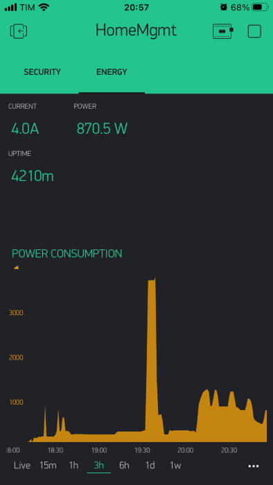

# Home Management

Arduino project that I use in my home.

### Features

- Using Blynk for UI on iPhone/Android (screenshots bellow)
- Wifi;
- 433mhz rolling code RF transmitter;
- Arm and Disarm my house security system;
- Night mode for security system (disable internal sensors but keep perimeters sensors on)
- Open and close my Garage Door and Gate;
- Measure my house energy consumption;

# Editor.md

